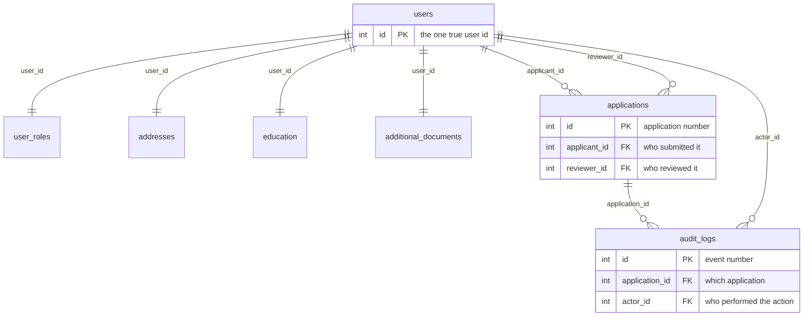

# 🛡️ KYC Verify

> A complete **Know Your Customer (KYC)** identity-verification system built with **plain PHP 8**, **MySQL**, and **XAMPP** — no Node.js, no Django, no external cloud services.

    

---

## ✨ Highlights

- 🛡️ **Role-based dashboards** — distinct views for Applicants, Admins, Super Admins, and the CEO
- 📧 **Email notifications via SMTP (PHPMailer)** — all staff are notified the moment an application is submitted; the applicant is emailed on every review decision
- 🗂️ **Complete audit trail** — every application event is recorded with the acting user
- 📎 **Document uploads** — SEE, SLC & Graduate certificates plus Citizenship, Passport & License (JPG / PNG / PDF, 5 MB max)
- 🔐 **Secure by default** — CSRF tokens, PDO prepared statements, bcrypt password hashing, escaped output, role-gated actions
- 📊 **Staff-only analytics** — totals, pending / approved / rejected / changes-requested counts and the recent-applications tables are visible **only** to Admin, Super Admin, and CEO

## 📚 Documentation

New to the codebase? Start here:

| Document                                     | What it explains                                                                                                |
| -------------------------------------------- | --------------------------------------------------------------------------------------------------------------- |
| [docs/ARCHITECTURE.md](docs/ARCHITECTURE.md) | Request lifecycle, file map, roles & permissions, workflow states, security model, contributor conventions      |
| [docs/DATABASE.md](docs/DATABASE.md)         | Full schema reference, design rules (why `user_id` is the PK in one-to-one tables), seeded data, common queries |

Every PHP file also starts with a docblock describing its own purpose.

## 🧑‍🤝‍🧑 Roles & permissions

| Role            | Dashboard                       | Capabilities                                                              |
| --------------- | ------------------------------- | ------------------------------------------------------------------------- |
| **APPLICANT**   | Personal KYC dashboard          | Create, complete, submit and resubmit applications; upload documents      |
| **ADMIN**       | Review queue & all applications | Review, approve, reject, request resubmission                             |
| **SUPER_ADMIN** | Review queue + user management  | Everything Admin can do, plus create users, change roles, reset passwords |
| **CEO**         | Company analytics               | KPIs, approval rate, pipeline breakdown, email activity                   |

> 💡 **Stats are staff-only.** Applicants see a clean personal dashboard — a welcome hero, a **+ New application** button, and an **Action needed** callout when a resubmission is requested. They never see company-wide totals or other users' applications.

## 🔑 How staff (CEO / Admin / Super Admin) get accounts

Staff members **cannot sign up through the public registration page** — that form always creates an `APPLICANT` account (an `APPLICANT` row is written to the `user_roles` table). Staff accounts are created in two ways:

1. **Seeded accounts** — `install.sql` inserts one account per staff role when you import the schema.
2. **Super Admin creates them** — the **Super Admin** is the gatekeeper. After signing in as `superadmin@kyc.local`, open **Users** (`?page=users`) and:
   - **Create a user** and choose the role: `APPLICANT`, `ADMIN`, `SUPER_ADMIN`, or `CEO`
   - **Change an existing user's role** — for example, promote an applicant to Admin
   - **Reset a user's password**

All user-management actions are protected by `require_role(['SUPER_ADMIN'])`, so a random person can never register themselves as CEO, Admin, or Super Admin.

### Sign-in flow

```text
Sign in → ?page=login → role-based dashboard
   CEO          → company analytics (KPIs, pipeline, email activity)
   SUPER_ADMIN  → review queue + user management
   ADMIN        → review queue + all applications
   APPLICANT    → personal KYC dashboard
```

## 🔑 Default staff logins

The database comes with three staff accounts pre-seeded by `install.sql`. Use these to explore each dashboard immediately:

| Role            | Email                  | Password      |
| --------------- | ---------------------- | ------------- |
| **CEO**         | `ceo@kyc.local`        | `Password123` |
| **SUPER_ADMIN** | `superadmin@kyc.local` | `Password123` |
| **ADMIN**       | `admin@kyc.local`      | `Password123` |

> ⚠️ These are **development-only demo credentials** — change them before any real deployment.

The public **Create an account** page always registers an `APPLICANT`, so employees and staff are created by the Super Admin instead:

1. Sign in as **Super Admin** (`superadmin@kyc.local` / `Password123`).
2. Open **Users** from the navigation (`?page=users`).
3. Use the **Create user** form — enter a username, email, password (at least 8 characters), and choose the role: `APPLICANT`, `ADMIN`, `SUPER_ADMIN`, or `CEO`.
4. Click **Create user**. The new employee can now sign in with the email and password you set.

You can also **change a user's role** or **reset a user's password** from the **Manage** menu next to each user in the list.

## 🧱 Technology stack

| Layer            | Used technology                            |
| ---------------- | ------------------------------------------ |
| Web server       | Apache, included with XAMPP                |
| Backend          | PHP 8.0+ (structured, function-based)      |
| Database         | MySQL / MariaDB                            |
| Database access  | PDO prepared statements                    |
| Authentication   | PHP sessions + `password_hash()`           |
| Email            | PHPMailer over SMTP (optional)             |
| Document storage | Local `uploads/users/<user-id>/` directory |
| Styling          | Responsive custom CSS                      |

## 🚀 Quick start with XAMPP

1. **Copy the project** to your XAMPP web root, for example:

   ```text
   C:\xampp\htdocs\kyc-v4
   ```

2. **Create your local environment file** from the template:

   ```text
   cp .env.example .env            # Linux / macOS / Git Bash
   copy .env.example .env          # Windows PowerShell / CMD
   ```

   The `.env` file holds your database and SMTP settings. It is **ignored by git**, so your credentials never get committed. If you skip this step, the built-in defaults are used.

3. **Install PHP dependencies** (PHPMailer). With [Composer](https://getcomposer.org) installed:

   ```text
   cd C:\xampp\htdocs\kyc-v4
   composer install
   ```

4. **Start Apache & MySQL** in the XAMPP Control Panel.

5. **Import the database schema** — open [phpMyAdmin](http://localhost/phpmyadmin), select **Import**, choose [install.sql](install.sql), and click **Import**. This creates the `kyc_system` database, all tables, and the seeded staff accounts.

6. **Open the application:**

   ```text
   http://localhost/kyc-v4/
   ```

7. **Test the flow** — register an applicant account, create an application, and submit it; the review team is notified by email.

> ⚠️ **Important:** If you imported an older version of this project's schema, first drop the old `kyc_system` database in phpMyAdmin, then import the revised [install.sql](install.sql). This prevents old tables or columns from conflicting with the normalized design.

## ⚙️ Configuration with `.env`

All settings live in `.env` (copy it from `.env.example`). [config.php](config.php) loads the file at startup with a lightweight built-in parser — no extra package needed — and falls back to sensible defaults when a variable is missing or the file does not exist.

| Variable           | Default                   | Description                                 |
| ------------------ | ------------------------- | ------------------------------------------- |
| `APP_NAME`         | `KYC Verify`              | Application name shown in the UI and emails |
| `APP_URL`          | `http://localhost/kyc-v4` | Base URL used in email links                |
| `UPLOAD_DIR`       | `uploads`                 | Folder where uploaded documents are stored  |
| `MAX_UPLOAD_BYTES` | `5242880`                 | Maximum upload size in bytes (5 MB)         |
| `DB_HOST`          | `127.0.0.1`               | MySQL host                                  |
| `DB_NAME`          | `kyc_system`              | MySQL database name                         |
| `DB_USER`          | `root`                    | MySQL username                              |
| `DB_PASS`          | _(empty)_                 | MySQL password                              |
| `MAIL_ENABLED`     | `false`                   | Set `true` to send real email via SMTP      |
| `SMTP_HOST`        | `smtp.gmail.com`          | SMTP server                                 |
| `SMTP_PORT`        | `587`                     | SMTP port                                   |
| `SMTP_USER`        | `your-email@gmail.com`    | SMTP username                               |
| `SMTP_PASS`        | `your-app-password`       | SMTP password / app password                |
| `SMTP_ENCRYPTION`  | `tls`                     | `tls` or `ssl`                              |
| `MAIL_FROM`        | `no-reply@kyc.local`      | From address for outgoing mail              |
| `MAIL_FROM_NAME`   | `KYC Verify`              | From name for outgoing mail                 |
| `APP_TIMEZONE`     | `Asia/Kathmandu`          | Application timezone                        |

Example `.env`:

```dotenv
APP_NAME="KYC Verify"
APP_URL="http://localhost/kyc-v4"

DB_HOST="127.0.0.1"
DB_NAME="kyc_system"
DB_USER="root"
DB_PASS=""

MAIL_ENABLED="true"
SMTP_HOST="smtp.gmail.com"
SMTP_PORT="587"
SMTP_USER="your-email@gmail.com"
SMTP_PASS="your-app-password"
SMTP_ENCRYPTION="tls"
MAIL_FROM="no-reply@kyc.local"
MAIL_FROM_NAME="KYC Verify"
```

> `MAIL_ENABLED`, `SMTP_PORT`, and `MAX_UPLOAD_BYTES` are parsed as real boolean / integer values, so use `true`/`false` and plain numbers there.

## 📧 Email / SMTP configuration

Email is **disabled by default** (`MAIL_ENABLED = false`). Every message is still recorded in the `email_logs` table, so you can verify notifications without a mail server.

To send real email, set these values in `.env`:

```dotenv
MAIL_ENABLED="true"
SMTP_HOST="smtp.gmail.com"
SMTP_PORT="587"
SMTP_USER="your-email@gmail.com"
SMTP_PASS="your-app-password"   # Google App Password, not your normal password
SMTP_ENCRYPTION="tls"
MAIL_FROM="no-reply@kyc.local"
MAIL_FROM_NAME="KYC Verify"
APP_URL="http://localhost/kyc-v4"   # base URL used in email links
```

**Who gets notified:**

| Event                              | Recipient(s)                        |
| ---------------------------------- | ----------------------------------- |
| Application submitted              | All staff (CEO, Super Admin, Admin) |
| Approved / Rejected / Resubmission | The applicant (with review notes)   |

For Gmail you must enable **2-Step Verification** and create an **App Password**. For other providers adjust `SMTP_HOST`, `SMTP_PORT`, and `SMTP_ENCRYPTION` accordingly.

## 🗄️ Database configuration

The default XAMPP MySQL credentials are set in `.env`:

```dotenv
DB_HOST="127.0.0.1"
DB_NAME="kyc_system"
DB_USER="root"
DB_PASS=""
```

Update these values only if your MySQL username, password, or database name is different.

## 🧬 Database design

`users` is the parent table. All user-profile data uses `user_id` as a foreign key to `users.id`.

```text
users (id)
 ├── user_roles (user_id)
 ├── addresses (user_id)
 ├── education (user_id)
 ├── additional_documents (user_id)
 └── applications (applicant_id)
       └── audit_logs (application_id)
```

| Table                  | Main fields                                                                | Purpose                                            |
| ---------------------- | -------------------------------------------------------------------------- | -------------------------------------------------- |
| `users`                | `id`, `username`, `email`, `password_hash`                                 | Applicant, admin, super admin, and CEO accounts    |
| `user_roles`           | `user_id`, `role`                                                          | The only place roles are stored (one row per user) |
| `addresses`            | `user_id`, `permanent_address`, `temporary_address`                        | A user's address record                            |
| `education`            | `user_id`, `see_document`, `slc_document`, `graduate_document`             | Paths for academic documents                       |
| `additional_documents` | `user_id`, `citizenship_document`, `passport_document`, `license_document` | Paths for government identity documents            |
| `applications`         | `applicant_id`, KYC details, `status`, review data                         | KYC workflow and review status                     |
| `audit_logs`           | `application_id`, `actor_id`, `action`, `detail`                           | Record of important application events             |
| `email_logs`           | `recipient`, `subject`, `body`, `status`, `error`                          | Outbox for every email the system sends            |

The `addresses`, `education`, and `additional_documents` tables each have a `UNIQUE user_id` constraint — one current record per user — and all of these foreign keys use `ON DELETE CASCADE`.

### 🔗 Understanding the IDs (`id`, `user_id`, `application_id`, `reviewer_id`, `actor_id`)

Every ID in the database is either a table's **own primary key** or a **foreign key pointing to another table**. This diagram shows who points to whom:



| ID               | Where it lives                                                  | What it means                                                                                                               |
| ---------------- | --------------------------------------------------------------- | --------------------------------------------------------------------------------------------------------------------------- |
| `id`             | `users.id`, `applications.id`, `audit_logs.id`, `email_logs.id` | The table's **own primary key** — a unique number for each row in that table                                                |
| `user_id`        | `user_roles`, `addresses`, `education`, `additional_documents`  | Points to `users.id`. These tables hold **one row per user**, so `user_id` is also their primary key (no extra `id` needed) |
| `applicant_id`   | `applications`                                                  | Points to `users.id` — the user **who submitted** the application                                                           |
| `reviewer_id`    | `applications`                                                  | Points to `users.id` — the staff member **who reviewed** it (NULL until reviewed)                                           |
| `application_id` | `audit_logs`                                                    | Points to `applications.id` — which application the event belongs to                                                        |
| `actor_id`       | `audit_logs`                                                    | Points to `users.id` — the user **who performed** the logged action                                                         |

**Why different names?** `applicant_id`, `reviewer_id`, and `actor_id` all reference the same `users` table, but each name describes a different _role_ that user plays. A single person can be an applicant on one application and a reviewer on another — the names make the SQL self-explaining:

```sql
-- "Who submitted application 5, and who reviewed it?"
SELECT applicant.username AS submitted_by, reviewer.username AS reviewed_by
FROM applications a
JOIN users applicant ON applicant.id = a.applicant_id
LEFT JOIN users reviewer ON reviewer.id = a.reviewer_id
WHERE a.id = 5;
```

> 💡 **Rule of thumb:** one-to-one tables (`user_roles`, `addresses`, `education`, `additional_documents`) are keyed by `user_id` only; one-to-many tables (`applications`, `audit_logs`, `email_logs`) keep their own `id` because one user/application can have many rows.

## 🔄 Application workflow

```text
DRAFT → SUBMITTED → UNDER REVIEW → APPROVED
                                ├→ REJECTED
                                └→ RESUBMISSION REQUESTED → DRAFT/UPDATED → SUBMITTED
```

- **DRAFT** — the applicant saves progress; everything is editable.
- **SUBMITTED** — queued for review; all staff are notified by email.
- **UNDER REVIEW** — a staff member has opened the application.
- **APPROVED / REJECTED** — final decision; the applicant is emailed with review notes.
- **RESUBMISSION REQUESTED** — the applicant must fix the flagged details and resubmit.

## 📂 Project structure

```text
index.php          Front controller — sessions, CSRF, routing
config.php         Loads .env and defines all app settings
.env.example       Template for your local .env (copy to .env)
.env               Your local secrets (ignored by git, not committed)
database.php       PDO connection
functions.php      Core helpers (output, uploads, queries, badges)
auth.php           Login / role helpers
mailer.php         Email sending via PHPMailer + email_logs
actions.php        All POST handlers (auth, applications, review, users)
layout.php         Shared header / footer / navigation
pages/             One file per page (login, dashboard, review, users, ...)
docs/              Developer guides (ARCHITECTURE.md, DATABASE.md)
assets/style.css   Design system and responsive layout
install.sql        Schema + seeded staff accounts
api.php            JSON read API (optional, kept for integrations)
api_actions.php    JSON write API (optional, kept for integrations)
frontend/          Optional React/Vite reference app (not required to run)
.gitignore         Excludes .env, uploads, and vendor from git
```

> 💡 **Pure PHP + MySQL.** The system runs entirely on server-rendered PHP —
> no Node.js, no build step. Copy the folder into `htdocs`, import
> `install.sql`, and open it in the browser. The `frontend/` React app is kept
> only as a reference and is not needed.

## 🛡️ Security

| Area          | Implementation                                                                |
| ------------- | ----------------------------------------------------------------------------- |
| Passwords     | `password_hash()` / `password_verify()` (bcrypt)                              |
| Sessions      | `session_regenerate_id()` on login; `httponly` + `SameSite=Lax` cookies       |
| CSRF          | Token on every POST form, verified with `hash_equals()`                       |
| SQL injection | PDO prepared statements with `ATTR_EMULATE_PREPARES => false`                 |
| XSS           | All user output escaped with `htmlspecialchars()` via the `e()` helper        |
| Uploads       | MIME sniffing (`finfo`), 5 MB cap, random stored filenames                    |
| Authorization | `require_role()` gates every staff page and action; documents scoped per user |
| Auditing      | `audit_logs` records every application event with the acting user             |

## ⚡ Performance (low-end → high-end devices)

The system is designed to run smoothly on everything from an old laptop or a
small XAMPP box up to a production server — **without removing any features**:

| Technique                           | What it does                                                                                                                                                                   |
| ----------------------------------- | ------------------------------------------------------------------------------------------------------------------------------------------------------------------------------ |
| **Single-query stats**              | Dashboard / CEO / API counters use one `GROUP BY` query (`application_status_counts()`, `email_status_counts()`) instead of 6–11 separate `COUNT(*)` round-trips per page load |
| **Database indexes**                | `applications` (status, applicant, created/updated), `audit_logs` (application), `email_logs` (status, recipient) keep every list and filter fast as data grows                |
| **Gzip compression**                | `.htaccess` compresses HTML/CSS/JS/JSON responses, cutting transfer size                                                                                                       |
| **Browser caching**                 | Static assets are cached for 7–30 days; the stylesheet is cache-busted with its file mtime so updates still apply instantly                                                    |
| **No build step / no JS framework** | Pure server-rendered PHP means no bundler, no Node, and minimal client-side work — ideal for low-power devices                                                                 |
| **Lazy DB connection**              | `db()` opens one PDO connection per request (static singleton)                                                                                                                 |

> 💡 Re-running `sudo bash deploy-xampp.sh` automatically adds any missing
> performance indexes to an existing database (safe to run repeatedly).

## 📜 License

Local project — free to use, modify, and learn from. The seeded demo credentials are **development-only**; rotate them for any real deployment.
