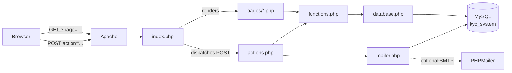
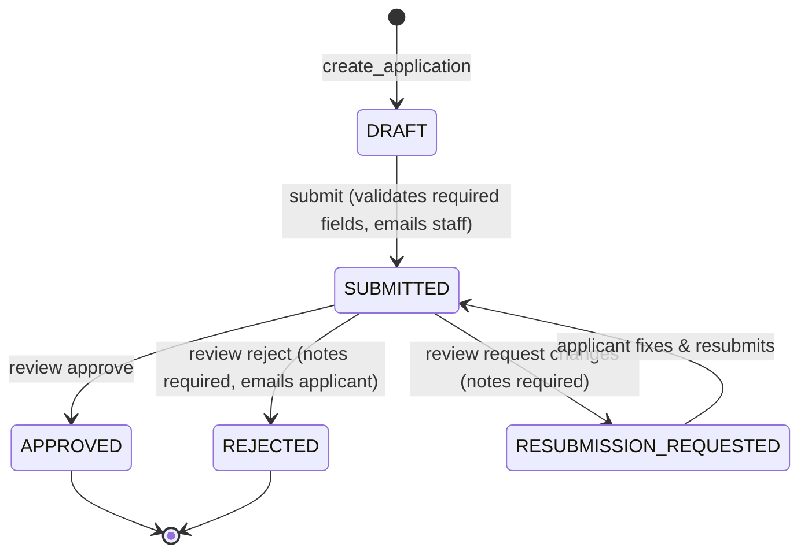

# 🏗️ Architecture Guide

> How the KYC Verify system is organized. Read this first if you are new to the codebase.

## 1. Big picture

KYC Verify is a **server-rendered PHP + MySQL** web application. There is no
JavaScript framework in the runtime path — every page is generated by PHP on
the server, and forms submit classic POST requests. It runs directly in XAMPP
(Apache + MariaDB/MySQL + PHP 8).



## 2. Request lifecycle

### Page view (GET)

```
GET /kyc-v4/index.php?page=dashboard
        │
        ▼
index.php
  1. starts the session
  2. loads functions.php → auth.php → layout.php
  3. checks the user is signed in (redirects to ?page=login if not)
  4. validates ?page= against the allow-list
  5. requires pages/<page>.php, which:
       - enforces its own role rules (require_role())
       - queries the database via db()
       - prints HTML between header_html() and footer_html()
```

### Form submission (POST)

```
POST /kyc-v4/index.php   (fields: csrf, action, ...)
        │
        ▼
index.php
  1. verify_csrf() — rejects the request with a flash error on mismatch
  2. requires actions.php
  3. handle_action($_POST['action']) performs the work:
       - validates input
       - writes to the database (PDO prepared statements)
       - logs to audit_logs where relevant
       - sends notification emails (logged in email_logs)
       - flash('success', ...) + redirect('?page=...')   ← PRG pattern
  4. on RuntimeException / PDOException → error flash, page re-renders
```

The **Post/Redirect/Get (PRG)** pattern means a browser refresh never
re-submits a form.

## 3. File map

### Entry points

| File              | Role                                                                                  |
| ----------------- | ------------------------------------------------------------------------------------- |
| `index.php`       | **Front controller.** Session bootstrap, POST dispatch, `?page=` routing.             |
| `api.php`         | Optional JSON **read** API (`GET ?action=...`). Same session/CSRF as the app.         |
| `api_actions.php` | Optional JSON **write** API (`POST`). Mirrors `actions.php` for programmatic clients. |

### Core layers (loaded in this order)

| File            | Role                                                                            |
| --------------- | ------------------------------------------------------------------------------- |
| `config.php`    | Loads `.env`, defines all settings (`APP_*`, `DB_*`, `SMTP_*`, …).              |
| `database.php`  | `db()` — shared PDO connection (exceptions, assoc fetch, real prepares).        |
| `functions.php` | Helpers: escaping, CSRF, JSON envelopes, audit logging, uploads, badges.        |
| `auth.php`      | Session user access: `user()`, `require_login()`, `require_role()`, API guards. |
| `mailer.php`    | `send_email()` via PHPMailer; always records to `email_logs`.                   |
| `actions.php`   | All POST handlers (auth, applications, review, user management).                |
| `layout.php`    | `header_html()` / `footer_html()` — shared chrome + role-aware nav.             |

### Pages (`pages/`)

| File               | Route                    | Access                         |
| ------------------ | ------------------------ | ------------------------------ |
| `login.php`        | `?page=login`            | public                         |
| `register.php`     | `?page=register`         | public (creates APPLICANT)     |
| `dashboard.php`    | `?page=dashboard`        | signed in (role-aware content) |
| `applications.php` | `?page=applications`     | signed in (own vs. all)        |
| `application.php`  | `?page=application&id=N` | owner or staff                 |
| `review.php`       | `?page=review`           | staff                          |
| `users.php`        | `?page=users`            | SUPER_ADMIN                    |
| `ceo.php`          | `?page=ceo`              | CEO                            |

### Assets & data

| Path                    | Role                                                                             |
| ----------------------- | -------------------------------------------------------------------------------- |
| `assets/style.css`      | The entire design system (no CSS framework).                                     |
| `uploads/users/<id>/`   | Uploaded documents (random filenames, JPG/PNG/PDF ≤ 5 MB).                       |
| `install.sql`           | Full schema + seeded staff accounts + default profile data.                      |
| `.env` / `.env.example` | Local configuration (DB credentials, SMTP). Never committed.                     |
| `vendor/`               | Composer dependencies (PHPMailer). Install with `composer install`.              |
| `frontend/`             | **Reference only** — an older React/Vite version of the UI. Not used at runtime. |

## 4. Roles & permissions

| Role          | Dashboard        | Can do                                                              |
| ------------- | ---------------- | ------------------------------------------------------------------- |
| `APPLICANT`   | personal         | create/submit/resubmit own applications, upload documents           |
| `ADMIN`       | review workspace | review (approve/reject/request changes), see all applications       |
| `SUPER_ADMIN` | review workspace | everything Admin does + create users, change roles, reset passwords |
| `CEO`         | analytics        | company KPIs, pipeline, email activity                              |

Enforcement points:

- **Pages** call `require_role([...])` at the top → 403 for the wrong role.
- **Actions** re-check roles server-side (`require_role()` inside handlers) —
  UI hiding alone is never trusted.
- **Data access**: `can_access()` allows only the applicant or staff to view an
  application; documents are stored per-user under `uploads/users/<id>/`.

## 5. Application workflow



Every transition writes a row to `audit_logs` (who did what, when).

## 6. Security model

| Threat              | Defense                                                                  |
| ------------------- | ------------------------------------------------------------------------ |
| SQL injection       | PDO prepared statements everywhere, `EMULATE_PREPARES = false`           |
| XSS                 | all output escaped with `e()` (`htmlspecialchars`)                       |
| CSRF                | per-session token, `hash_equals()` check on every POST (`verify_csrf()`) |
| Password theft      | `password_hash()` bcrypt; never stored or returned in plaintext          |
| Session hijacking   | `session_regenerate_id()` on login; `HttpOnly` + `SameSite=Lax` cookies  |
| Unauthorized access | role guards on pages **and** actions; per-user document scoping          |
| Malicious uploads   | MIME sniffing via `finfo`, 5 MB cap, random stored filenames             |
| Sensitive files     | `.htaccess` blocks `.sql`, `.md`, `.env`; `Options -Indexes`             |

## 7. Email notifications

`MAIL_ENABLED=false` by default — emails are **not sent**, but every message
is still written to `email_logs`, so the notification flow is fully testable
offline. Set SMTP credentials in `.env` and `MAIL_ENABLED=true` to deliver.

| Event                                   | Recipients                          |
| --------------------------------------- | ----------------------------------- |
| Application submitted                   | all staff (CEO, SUPER_ADMIN, ADMIN) |
| Approved / Rejected / Changes requested | the applicant (with reviewer notes) |

## 8. Conventions for contributors

1. **One page = one file** in `pages/`; register it in the allow-list in `index.php`.
2. **All writes go through `actions.php`** (or `api_actions.php` for JSON) —
   never write to the DB from a page file.
3. **Use `db()->prepare()`** with placeholders — never interpolate input into SQL.
4. **Escape all output** with `e()`.
5. **Add a CSRF hidden input** (`<input type="hidden" name="csrf" value="<?= csrf() ?>">`) to every form.
6. **Log meaningful events** with `log_action()`.
7. **Keep schema changes in `install.sql`** and migrate the live DB to match.
8. Every PHP file starts with a docblock explaining its purpose — keep it updated.
