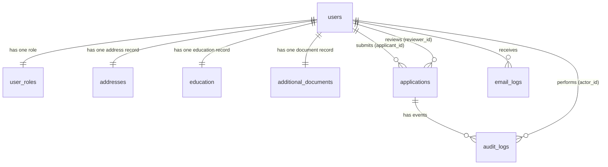

# 🗄️ Database Guide

> Schema reference for the `kyc_system` database. The authoritative definition
> is [`install.sql`](../install.sql) — this document explains the _why_.

## 1. Entity overview



## 2. Design rules

1. **`users` is the parent table.** Every profile table links to `users.id`.
2. **One-to-one tables use `user_id` as their PRIMARY KEY** — no extra `id`
   column. There is exactly one row per user, so `user_id` already uniquely
   identifies the row. Applies to: `user_roles`, `addresses`, `education`,
   `additional_documents`.
3. **One-to-many tables keep their own `id`** because the foreign key repeats
   (one user → many applications; one application → many audit events).
   Applies to: `applications`, `audit_logs`, `email_logs`.
4. **Foreign keys describe the role** of the referenced user:
   `applicant_id` (who submitted), `reviewer_id` (who decided),
   `actor_id` (who performed the logged action). All point to `users.id`.
5. **Cascade deletes** for profile data (`ON DELETE CASCADE`); reviewer and
   actor references use `ON DELETE SET NULL` so history survives user removal.

## 3. Table reference

### `users` — accounts

| Column          | Type                | Notes                         |
| --------------- | ------------------- | ----------------------------- |
| `id`            | INT UNSIGNED PK     | auto-increment user id        |
| `username`      | VARCHAR(120)        | display name                  |
| `email`         | VARCHAR(190) UNIQUE | login identifier (lowercased) |
| `password_hash` | VARCHAR(255)        | bcrypt via `password_hash()`  |
| `created_at`    | TIMESTAMP           |                               |

> ⚠️ No `role` column here — roles live **only** in `user_roles`.

### `user_roles` — the single role table

| Column    | Type            | Notes                                         |
| --------- | --------------- | --------------------------------------------- |
| `user_id` | INT UNSIGNED PK | FK → `users.id`, CASCADE                      |
| `role`    | ENUM            | `APPLICANT` / `ADMIN` / `SUPER_ADMIN` / `CEO` |

Exactly one row per user. Registration inserts `APPLICANT`; the Super Admin
changes roles with `INSERT ... ON DUPLICATE KEY UPDATE`.

### `addresses` — one record per user

| Column              | Type            | Notes                    |
| ------------------- | --------------- | ------------------------ |
| `user_id`           | INT UNSIGNED PK | FK → `users.id`, CASCADE |
| `permanent_address` | TEXT            | required                 |
| `temporary_address` | TEXT            | optional                 |
| `updated_at`        | TIMESTAMP       | auto-updates             |

### `education` — academic certificates (file paths)

| Column                                                | Type            | Notes                    |
| ----------------------------------------------------- | --------------- | ------------------------ |
| `user_id`                                             | INT UNSIGNED PK | FK → `users.id`, CASCADE |
| `see_document` / `slc_document` / `graduate_document` | VARCHAR(255)    | stored filename or NULL  |
| `updated_at`                                          | TIMESTAMP       |                          |

### `additional_documents` — government IDs (file paths)

| Column                                                            | Type            | Notes                    |
| ----------------------------------------------------------------- | --------------- | ------------------------ |
| `user_id`                                                         | INT UNSIGNED PK | FK → `users.id`, CASCADE |
| `citizenship_document` / `passport_document` / `license_document` | VARCHAR(255)    | stored filename or NULL  |
| `updated_at`                                                      | TIMESTAMP       |                          |

### `applications` — the KYC workflow

| Column                                                      | Type              | Notes                                                                                  |
| ----------------------------------------------------------- | ----------------- | -------------------------------------------------------------------------------------- |
| `id`                                                        | INT UNSIGNED PK   | application number                                                                     |
| `applicant_id`                                              | INT UNSIGNED      | FK → `users.id`, CASCADE — who submitted                                               |
| `reviewer_id`                                               | INT UNSIGNED NULL | FK → `users.id`, SET NULL — who reviewed                                               |
| `status`                                                    | ENUM              | `DRAFT`, `SUBMITTED`, `UNDER_REVIEW`, `APPROVED`, `REJECTED`, `RESUBMISSION_REQUESTED` |
| `full_name`, `date_of_birth`, `nationality`                 |                   | personal details                                                                       |
| `id_type`, `id_number`, `id_issue_date`, `issuing_district` |                   | identity document details                                                              |
| `review_notes`, `reviewed_at`                               |                   | filled by the reviewer                                                                 |
| `created_at`, `updated_at`                                  | TIMESTAMP         |                                                                                        |

Indexed on `status` (the review queue filters by it).

### `audit_logs` — complete event history

| Column           | Type              | Notes                                                              |
| ---------------- | ----------------- | ------------------------------------------------------------------ |
| `id`             | INT UNSIGNED PK   | one row per event (many per application)                           |
| `application_id` | INT UNSIGNED      | FK → `applications.id`, CASCADE                                    |
| `actor_id`       | INT UNSIGNED NULL | FK → `users.id`, SET NULL — who acted                              |
| `action`         | VARCHAR(60)       | `CREATED`, `UPDATED`, `DOCUMENT_UPLOADED`, `SUBMITTED`, `REVIEWED` |
| `detail`         | TEXT              | human-readable description                                         |
| `created_at`     | TIMESTAMP         |                                                                    |

### `email_logs` — notification outbox

| Column            | Type            | Notes                  |
| ----------------- | --------------- | ---------------------- |
| `id`              | INT UNSIGNED PK |                        |
| `recipient`       | VARCHAR(190)    | indexed                |
| `subject`, `body` |                 | full message content   |
| `status`          | ENUM            | `SENT` / `FAILED`      |
| `error`           | TEXT NULL       | SMTP error when failed |
| `created_at`      | TIMESTAMP       |                        |

Works even with `MAIL_ENABLED=false` — messages are logged, not delivered.

## 4. Seeded data (from `install.sql`)

Importing `install.sql` creates:

1. **Three staff accounts** (password for all: `Password123`):

   | user_id | email                  | role        |
   | ------- | ---------------------- | ----------- |
   | 1       | `ceo@kyc.local`        | CEO         |
   | 2       | `superadmin@kyc.local` | SUPER_ADMIN |
   | 3       | `admin@kyc.local`      | ADMIN       |

2. **Default profile rows** for each staff account: one `addresses` row, one
   `education` row, one `additional_documents` row (documents NULL until
   uploaded), one `DRAFT` application with personal/ID details, and a
   `CREATED` entry in `audit_logs`.

## 5. Common queries used by the app

```sql
-- Login: fetch account with its role
SELECT u.*, ur.role
FROM users u JOIN user_roles ur ON ur.user_id = u.id
WHERE u.email = ?;

-- Review queue
SELECT a.*, u.username applicant_name
FROM applications a JOIN users u ON u.id = a.applicant_id
WHERE a.status IN ('SUBMITTED','UNDER_REVIEW')
ORDER BY a.created_at ASC;

-- Role counts (Users page summary)
SELECT role, COUNT(*) c FROM user_roles GROUP BY role;

-- Audit trail for one application
SELECT l.*, u.username actor_name
FROM audit_logs l LEFT JOIN users u ON u.id = l.actor_id
WHERE application_id = ? ORDER BY l.created_at DESC;
```

## 6. Changing the schema

1. Edit `install.sql` (fresh installs must always work from scratch).
2. Apply the equivalent `ALTER`/`CREATE` statements to the live database.
3. Update every PHP query that touches the changed columns
   (search the codebase for the table/column name).
4. Update this document and the README table.
5. Test: login, application save/submit, review, user management.
